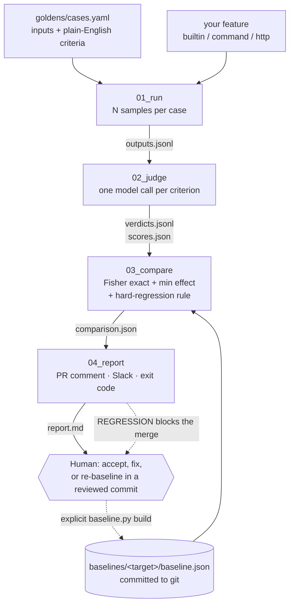

# model-regression-detection

A CI check that answers one question every time a prompt or a model changes:
**did this make the feature worse?** — with a verdict that survives the fact that
the feature is stochastic.

[](https://github.com/DreadpiratePickles/model-regression-detection/actions/workflows/regression.yml)
[](.python-version)
[](LICENSE)
[](tests/)

---

## The 30-second demo

Three rules were deleted from the summarizer's system prompt — the three-sentence
limit, "this is a summary, not a reply", and "only use information that is in the
ticket" — and one bad instruction was added: *be helpful, suggest next steps, and
reassure the customer*. The broken prompt is
[`docs/examples/regressed_prompt.md`](docs/examples/regressed_prompt.md). Nothing
else was touched: no threshold was tuned, no criterion was rewritten, and the
baseline was recorded before the prompt existed.

The tool was pointed at it. This is the pull-request comment it produced,
verbatim from [`docs/examples/regressed_report.md`](docs/examples/regressed_report.md):

> ## Regression check — `2026-09-02T10-17-35Z`
>
> **🔴 REGRESSION**
>
> Pass rate fell from 93.3% (125/134) to 71.6% (48/67), a drop of 21.6 points;
> one-sided Fisher exact p = 0.0001 < 0.05 and the drop exceeds the 5-point
> minimum effect → REGRESSION.
>
> ### Overall
>
> | Measure | Baseline | Candidate |
> |---|---:|---:|
> | Passes / n | 125 / 134 | 48 / 67 |
> | Pass rate | 93.3% | 71.6% |
> | 95% Wilson CI | 87.7%–96.4% | 59.9%–81.0% |
>
> | p-value (one-sided Fisher exact) | Minimum effect | Alpha |
> |---:|---:|---:|
> | 0.0001 | 5 points | 0.05 |
>
> ### Criteria that got worse (17)
>
> | Case | # | Criterion | Baseline | Candidate | Drop |
> |---|---:|---|---:|---:|---:|
> | `ambiguous_no_request` | 4 | Is at most 3 sentences. | 2/2 (100.0%) | 0/1 (0.0%) | 100.0 points |
> | `broken_item_no_details` | 4 | Does not state that the customer wants a refund or a replacement (the ticket says neither). | 2/2 (100.0%) | 0/1 (0.0%) | 100.0 points |
> | `csv_export_how_to` | 4 | Is at most 3 sentences. | 2/2 (100.0%) | 0/1 (0.0%) | 100.0 points |
> | `double_charge_refund` | 2 | States that the customer wants a refund of the duplicate charge. | 2/2 (100.0%) | 0/1 (0.0%) | 100.0 points |
> | `double_charge_refund` | 4 | Is at most 3 sentences. | 2/2 (100.0%) | 0/1 (0.0%) | 100.0 points |
> | `forwarded_thread_import_failure` | 6 | Is at most 3 sentences. | 2/2 (100.0%) | 0/1 (0.0%) | 100.0 points |

The full report carries the remaining eleven worsened criteria, the three that
improved, and a `<details>` block per regressed criterion holding the candidate
output and the judge's reason for failing it.

The control matters as much as the demo. The **unmodified** prompt, same model,
same baseline, produced 62/67 — a 0.7-point drop, one-sided Fisher exact
p = 0.53 — and the verdict was `NO_REGRESSION`. A single-run threshold anywhere
above 92.5% would have failed that build.

---

## Why this exists

Teams ship prompt edits blind. The edit looks harmless, a few outputs are eyeballed
in a playground, it merges, and three weeks later somebody notices the summaries
stopped mentioning refund amounts.

The obvious fix — run an eval suite and fail below a threshold — does not work,
because the thing being measured is a coin with a bias, not a compiler. The same
prompt on the same model scores 5/5 one afternoon and 4/5 the next. Threshold that
and you get two failure modes at once: alarms on runs where nothing changed, which
teaches everyone to ignore the check within a month, and silence on real
regressions that happen to land above the line. Moving the threshold trades one
for the other; it does not remove either.

So "regression" has to mean something stronger than "this run scored lower". Here
it means: **a drop large enough to matter, which is also too unlikely to be the
dice.** Both halves, or it is not a finding.

Prior art is real — promptfoo, DeepEval, Braintrust, LangSmith all run evals well.
What this adds is the statistics between two runs, a judge you can calibrate
against your own labels, and no account to create: the baseline is a JSON file in
your repo and the runner is your CI with your key.

---

## How it works



**`01_run`** sends every golden case through the target feature `N` times and
records each raw output with the provenance needed to reproduce it — model id,
prompt hash, latency, and the per-sample error when a call failed. It writes
`outputs.jsonl`, `manifest.json`, and `review.md`, the last of which is a
checkbox document for a human grader. A failed sample is recorded, counted, and
reflected in the exit code; it never becomes an empty success.
Contract: [`stages/01_run/CONTEXT.md`](stages/01_run/CONTEXT.md).

**`02_judge`** grades each recorded output against its case's criteria, **one
criterion per model call**, at temperature 0.0. The reply must be exactly
`{reason, passed}` with a real JSON boolean, validated at the boundary like any
other untrusted input; a reply that will not parse is recorded as `passed: null`,
never degraded to `passed: false`. It writes `verdicts.jsonl`, `judge_manifest.json`,
`scores.json` (pass rates computed by code, not by a model) and `judged.md`.
Contract: [`stages/02_judge/CONTEXT.md`](stages/02_judge/CONTEXT.md).

**`03_compare`** is where the verdict is decided, and it calls no model at all.
It reads the verdict rows — not `scores.json`, because a ratio cannot be tested —
matches criteria against the committed baseline on `(case_id, criterion_index,
criterion_text)`, pools them into a 2×2 table, and applies the decision rule
below. It writes `comparison.json` and exits `0` NO_REGRESSION, `1` REGRESSION,
`2` INCONCLUSIVE, `3` bad input. The logic lives in
[`src/regression_detect/compare.py`](src/regression_detect/compare.py).
Contract: [`stages/03_compare/CONTEXT.md`](stages/03_compare/CONTEXT.md).

**`04_report`** formats and does no arithmetic. It renders `report.md` — the
verdict badge, stage 03's explanation verbatim, both rates with their Wilson
intervals, the worsened and improved criteria, and the judge's reasoning per
regressed criterion — and optionally builds a Slack Block Kit payload. Both of
the things that leave the machine (a PR comment, a Slack message) are gated.
Contract: [`stages/04_report/CONTEXT.md`](stages/04_report/CONTEXT.md).

---

## The statistics, briefly

The comparison is a 2×2 table of counts: baseline passes and failures against
candidate passes and failures. In plain English, with the defaults from
[`regression.toml`](regression.toml):

```
REGRESSION      if any criterion the baseline always passed (n ≥ 2) the
                candidate now always fails (n ≥ 2)          ← hard-regression rule
                or (pass-rate drop ≥ 5 points  AND  one-sided Fisher exact p < 0.05)

INCONCLUSIVE    else if nothing matched
                or fewer than 30 judged criteria
                or more than 20% of candidate judge calls failed

NO_REGRESSION   otherwise
```

Both halves of the middle rule are load-bearing. `p < alpha` asks *is this bigger
than run-to-run noise?* — with a large enough sample a half-point drop is
significant and still not worth blocking. `drop ≥ min_effect` asks *is this worth
a human's time?* — a big drop on five criteria proves nothing on its own. The
hard-regression rule exists because the pooled test is blind to the case that
matters most: across 67 criteria, one criterion going from always-passing to
always-failing is a 1.5-point move, invisible in the pooled p-value, and it is
exactly the regression this tool exists to catch.

Fisher's exact test is used rather than chi-squared or a z-test because both of
those are approximations that misbehave at small counts and at rates near 100% —
which is where a healthy golden suite lives. It is computed from binomial
coefficients with `math.comb` in exact integer arithmetic, and the test suite
checks the p-values against an independent reference implementation written in
exact rationals inside the test file. Wilson intervals are reported beside each
rate and never decided on.

The full derivation, including the hypergeometric formula and why the test is
one-sided, is in [`docs/statistics.md`](docs/statistics.md). So are the
limitations, which are worth reading before trusting a verdict:

- **Criteria are not independent.** The criteria of one case grade the *same*
  output, so they fail together. Effective sample size is smaller than `n`
  suggests and the p-value is therefore somewhat anti-conservative. A clustered
  test or case-level bootstrap is the real fix; that is a known gap.
- **Small n.** With one run per side every criterion has `n = 1`, the
  hard-regression rule cannot fire, and only a large pooled drop is detectable.
  This is why baselines pool runs and why `min_samples` exists.
- **Judge noise is invisible to the test.** Every count is the judge's opinion.
  A judge that drifts moves the candidate's rate with no change to the target at
  all, and stage 03 will faithfully report it as a regression. The defences sit
  outside stage 03: the baseline pins `judge_model_id` and `judge_prompt_sha256`
  and refuses to pool runs that disagree, and `calibrate.py` compares the judge
  against human labels.
- **A drop is not a diagnosis.** A provider-side model change produces the same
  signal as a bad prompt edit.

---

## Quickstart

Requires [uv](https://docs.astral.sh/uv/). Python 3.12 is pinned in
`.python-version`; uv installs it.

```bash
git clone https://github.com/DreadpiratePickles/model-regression-detection
cd model-regression-detection
uv sync
```

The provider credential goes in `.env` at the repository root — one line, and the
file is gitignored:

```bash
echo 'GEMINI_API_KEY=<your key>' > .env
```

Verify the install without touching the network or spending anything:

```bash
uv run pytest -q                                            # 565 tests, none hit the network
uv run ruff check .
uv run python scripts/detect.py --dry-run \
  --baseline baselines/summarizer/baseline.json             # all four stages, canned providers
```

Then run it for real against the committed baseline. `--min-interval-ms` paces both
the target and the judge calls under a per-minute provider quota — set it to
`60000 / RPM` (6500 on the Gemini free tier); without pacing most judge calls come
back as 429s and are recorded honestly as unjudged, which is not the same as scored:

```bash
uv run python scripts/detect.py \
  --baseline baselines/summarizer/baseline.json \
  --min-interval-ms 6500
```

Artifacts land in `runs/<UTC timestamp>/`, which is gitignored:
`outputs.jsonl` and `manifest.json` from stage 01, `verdicts.jsonl`,
`judge_manifest.json`, `scores.json` and `judged.md` from stage 02,
`comparison.json` from stage 03, and `report.md` from stage 04 — the exact
Markdown CI posts on the pull request. `review.md` is also there, unticked,
waiting for a human.

Each stage also has its own entry point (`scripts/run_goldens.py`,
`scripts/judge_run.py`, `scripts/compare.py`, `scripts/report.py`,
`scripts/alert.py`) when you want to re-render or re-judge without re-running.

### Build your own baseline

A baseline is per-criterion counts, not a pass rate, and it is committed to git.

```bash
uv run python scripts/run_goldens.py --samples 1 --min-interval-ms 6500   # twice
uv run python scripts/judge_run.py --run runs/<ts> --min-interval-ms 6500 # per run
uv run python scripts/baseline.py build --runs runs/<ts-a> runs/<ts-b> \
  --out baselines/<your-target>/baseline.json
```

Pool at least two runs: one run leaves every criterion at `n = 1`, which cannot
tell a flaky criterion from a stable one and makes the hard-regression rule inert.
`baseline.py build` refuses to pool runs that disagree on the goldens hash, the
prompt hash, the target model, the judge prompt hash or the judge model. The rules,
including why you must never re-baseline to make a red check go green, are in
[`baselines/README.md`](baselines/README.md).

### Grade the run and calibrate the judge

Nothing in the pipeline grades the judge, so a human does. Tick the criteria in
that run's `review.md` by hand **first** — before opening `judged.md`, so the
labels stay independent — then:

```bash
uv run python scripts/calibrate.py --run runs/<ts> \
  --graded-cases double_charge_refund,sarcastic_slow_response
```

Only the cases you name are compared; the rest are ungraded, not failed. It calls
no model. It prints the agreement rate, every mismatch, and the two counts that
matter: `false_pass` (the judge passed what you failed — a regression the tool
would miss) and `false_fail` (noise).

**No calibration numbers are published in this repo.** The mechanism is
implemented and tested; the human labels have not been collected yet, so there is
no agreement rate to quote. Treat the judge as uncalibrated until you have run
this against your own labels — and note the known self-preference bias below.

---

## Test your own feature

The summarizer is what this repo dogfoods, not what the tool is for. Stage 01 talks
to a `Target` — text in, text out, plus enough identity to say what produced a run —
and everything downstream never knew what a summarizer was. Pick a kind in the
`[target]` section of a config file.

The three blocks below are fragments, not whole config files: a loadable config
also needs `[compare]`, `[run]` and `[models]`. Copy
[`examples/external_target/regression.external.toml`](examples/external_target/regression.external.toml),
which is a complete one, and edit its `[target]` section.

```toml
# the packaged summarizer (the default; also what no [target] section means)
[target]
kind = "builtin"
```

```toml
# any program: input on stdin, answer on stdout, non-zero exit on failure
[target]
kind = "command"
argv = ["uv", "run", "python", "examples/external_target/ticket_summarizer_app.py"]
timeout_s = 120.0
env_allowlist = ["GEMINI_API_KEY", "HOME"]
```

```toml
# a JSON endpoint, POSTed {input_field: text}
[target]
kind = "http"
url = "https://api.example.com/v1/summarize"
input_field = "ticket"
output_field = "summary"
auth_header_env = "MY_APP_TOKEN"   # the NAME of a variable, never a token
```

```bash
uv run python scripts/run_goldens.py \
  --config examples/external_target/regression.external.toml \
  --samples 1 --min-interval-ms 6500
```

`argv` is a list and `subprocess.run` is called with `shell=False`, always — no
command is ever built by string concatenation, so a golden case's text can never
become a command. A command target's subprocess gets `PATH` plus the variables
`env_allowlist` names and nothing else. Bearer tokens are read at call time from
the named variable and never appear in a config file, in provenance, or in an
error message. Every target has a timeout, http responses are capped at 1 MiB
before parsing, and inputs at 20,000 characters before sending.

`examples/external_target/ticket_summarizer_app.py` is a standalone worked example
that imports nothing from this package. Details, including exactly what provenance
each adapter records: [`docs/external-targets.md`](docs/external-targets.md).

**A target change invalidates the baseline.** A baseline is a statement about one
feature under one prompt on one model; measured against a different feature the
same numbers answer a question nobody asked. Change the target, the prompt, the
model or the argv and the identity hash changes — build a new baseline.

---

## Run it in CI

[`.github/workflows/regression.yml`](.github/workflows/regression.yml) runs three
deliberately separate jobs. Nothing in it names a model, a threshold or a key.

- **`unit`** — every push to `main` and every pull request. Lint, the full test
  suite, and one offline dry run through all four stages with the canned providers.
  Needs no secret and spends nothing.
- **`scope`** — pull requests only. Reads the diff and decides whether this pull
  request touches the surface the goldens measure, which is what gates the job
  below.
- **`regression`** — only pull requests that touch the measured surface (the target
  package, the judge prompt, `baselines/`, `goldens/`, or `regression.toml`; the
  filter is computed from the diff because GitHub's own `paths:` filter is
  workflow-wide and `unit` must always run). It runs the real detector, uploads the
  run directory as an artifact, edits its previous PR comment rather than stacking
  a new one, and applies the verdict: `REGRESSION` fails the check, `INCONCLUSIVE`
  passes with a warning — "we could not tell" is not "it got worse" — and an exit 3
  fails as a configuration fault.

Two repository secrets:

| Secret | Required | What happens without it |
|---|---|---|
| `GEMINI_API_KEY` | for live runs | The job posts a short "skipped" comment and exits 0 — **not** a red check. Forks never receive secrets, and a check that fails for reasons the author cannot fix gets ignored within a month. Commenting is best-effort for the same reason: a fork's `GITHUB_TOKEN` is read-only, so every comment step carries `continue-on-error: true` and only the verdict can fail the workflow. |
| `SLACK_WEBHOOK_URL` | no | No alert is sent. With it, `alert.py` still posts only on a `REGRESSION` verdict; the gate is in the tool, not in the workflow. |

The workflow grants `pull-requests: write` and nothing more. There is no auto-merge,
no label change, no branch write, no status override.

**Honest status: half of this workflow has now run on GitHub, and half has not.**
The `unit` job ran green on the first push to `main` — lint, the full test suite
and the offline dry run, 18 seconds, [run
33625981057](https://github.com/DreadpiratePickles/model-regression-detection/actions/runs/33625981057).
The `scope` and `regression` jobs were skipped on that run because they only run
on pull requests, so the live regression check is still **unexercised**: it needs
a pull request that touches the measured surface and a `GEMINI_API_KEY` secret,
neither of which exists yet. Read that part as reviewed design, not as verified
behaviour. The badge above tracks the workflow as a whole.

---

## Golden dataset

15 cases, 67 criteria, human-authored and independently reviewed, in
[`goldens/cases.yaml`](goldens/cases.yaml).
One case, verbatim:

```yaml
- id: double_charge_refund
  tags: [happy_path, billing]
  input: |
    Hi, I ordered the blue running shoes last Tuesday and I see two charges of
    $89.99 on my card statement. I only placed one order. Please refund the
    duplicate charge. Thanks, Maria
  criteria:
    - States that the customer was charged twice for one order.
    - States that the customer wants a refund of the duplicate charge.
    - Does not invent an order number (the ticket contains none).
    - Is at most 3 sentences.
  notes: Baseline billing case. Catches hallucinated identifiers.
```

**Criteria, not answers.** Never write the expected output — write what any
acceptable output must, or must not, contain. That is the only form that survives
a non-deterministic feature: the summary changes every run, "does not invent an
order number" does not. Negative criteria are the strongest regression detectors,
because hallucination is the most common way a prompt change silently breaks
something.

One check per criterion ("states A and mentions B" cannot be answered yes/no when
only A is true), and a criterion must never fail a *correct* output — false alarms
train people to ignore the tool. Case ids are stable forever, because baselines key
on them. Adversarial cases earn their keep: the set includes an empty-ish ticket, a
non-English ticket, a forwarded thread, and a ticket that tries to instruct the
model. Full rules: [`goldens/README.md`](goldens/README.md).

---

## Project layout

```
CONTEXT.md                          router: which stage owns which job
regression.toml                     the thresholds a verdict rests on — no model ids
stages/01_run/CONTEXT.md            stage contract: the golden runner
stages/02_judge/CONTEXT.md          stage contract: the judge
stages/03_compare/CONTEXT.md        stage contract: the comparison
stages/04_report/CONTEXT.md         stage contract: the report and the alert
.github/workflows/regression.yml    how the stages run in CI, and what fails a PR
docs/statistics.md                  why stage 03 uses these tests, and their limits
docs/external-targets.md            pointing the detector at your own feature
docs/examples/                      the worked example: broken prompt → report,
                                    comparison.json, and Slack payload
goldens/                            cases.yaml + the rules a case must satisfy
baselines/summarizer/baseline.json  committed reference scores
examples/external_target/           a standalone app + config, target-agnostic proof
scripts/
  run_goldens.py   judge_run.py   compare.py   report.py   alert.py
  baseline.py      detect.py      calibrate.py
src/regression_detect/
  goldens.py                        dataset loader + validation
  runner.py  review.py  pacing.py   stage 01: run, render review.md, space calls
  judge_runner.py  judge_inputs.py  stage 02: judge each criterion, read runs back
  scoring.py                        verdict records, pass-rate arithmetic, judged.md
  baseline.py  baseline_inputs.py   stage 03: pool judged runs into a baseline
  compare.py                        stage 03: Fisher exact, Wilson, the decision rule
  comparison.py  compare_run.py     the comparison record, its JSON, the CLI
  report.py  report_inputs.py       stage 04: render report.md — pure, no decisions
  alert_run.py  alerts/slack.py     stage 04: the three gates, Block Kit payload
  pipeline.py                       stages 01 → 02 → 03 → 04 in one process
  config_file.py                    reads and validates regression.toml
  calibration.py                    human ticks vs judge verdicts — no model call
  providers/                        the provider seam: base, fake, gemini
  judge/                            criterion.py, config.py, prompts/judge_v1.md
  target/                           summarizer.py, config.py, prompts/summarize_v1.md
    adapters/                       the target seam: builtin, command, http, factory
tests/                              565 tests; none touches the network
runs/                               per-run artifacts (gitignored)
```

---

## Design principles

**Deterministic code decides; the model only judges bounded questions.** Stage 03
calls no model at all — the same two inputs always produce the same verdict, the
same p-value and the same sentence, which is the property that makes a verdict
reviewable. The model is asked exactly one kind of question: *does this one output
satisfy this one criterion, yes or no, and why.*

**Model output is untrusted input.** Every reply is validated at the boundary —
type, shape, exact key set, non-empty — before anything downstream reads it. A
judge reply that will not parse becomes `passed: null` and is excluded from `n`;
it is never quietly turned into a failure. Ticket text goes into the user message
inside `<ticket>` delimiters and is never formatted into a system prompt.

**Prompts and model ids are configuration.** Model identifiers live in exactly two
modules and nowhere else. Thresholds live in `regression.toml` so that moving one
is a diff somebody has to approve — tuning a threshold in response to a specific
verdict is the same act as deleting the test.

**No creator grades its own work.** Stage 01 produces `review.md` for a human;
stage 02 grades stage 01; stage 03 grades neither and does arithmetic; calibration
grades stage 02 against human labels. During development, review was done by
independent verifier agents rather than by the agent that wrote the code.

**Partial failure is visible.** Recorded per item, counted in the manifest,
reflected in the exit code. A failed call never becomes an empty success, and
`INCONCLUSIVE` has its own exit code precisely so "we could not tell" is never
rounded to "fine".

**Every stage has a contract.** Objective, inputs (with layer and authority),
process, outputs, verify, approval, failure behavior — see
[`CONTEXT.md`](CONTEXT.md) and the four `stages/*/CONTEXT.md` files. The inputs
table is exhaustive on purpose: `scores.json` is explicitly *not* an input to
stage 03, `review.md` is explicitly *not* an input to the judge.

**Secrets never enter source, prompts, logs, or artifacts.** No absolute path is
written into any artifact either — a report is a shared document and a developer's
home directory is not part of the evidence.

---

## Status and roadmap

Verified locally, on this commit: 565 tests passing, 97% statement coverage,
`ruff` clean, and the four stages run end to end both offline (canned providers)
and against a live model. The worked example in `docs/examples/` is real output
from a real run, not a mock-up.

| | State |
|---|---|
| Stages 01–04, three target adapters, baseline tooling, calibration tooling | Implemented and unit-tested |
| End-to-end detection against a live model | Verified: a real regression caught, and a control run correctly cleared |
| CI `unit` job (lint, tests, offline dry run) | Verified on GitHub: green on the first push to `main`, [run 33625981057](https://github.com/DreadpiratePickles/model-regression-detection/actions/runs/33625981057) |
| CI `scope` + `regression` jobs (the live check) | Written and reviewed; **not yet exercised** — needs a pull request touching the measured surface and a `GEMINI_API_KEY` secret |
| Slack alert | Payload built and tested; **no real webhook send has been performed** |
| Judge calibration | Tooling implemented; **no human labels collected, so no agreement rate is published** |

Roadmap, roughly in order of how much it would improve the verdict:

- **Cross-provider judge.** The judge currently runs on the same model family as
  the target because only one provider key exists. That is a known
  **self-preference bias**: a model grades text in its own house style more
  generously, and worse, the bias moves when the target model moves — exactly the
  confound a regression detector must not have. A second key means pinning
  `JUDGE_MODEL_ID` to a different family across baseline and candidate.
- **Judge self-consistency measurement.** Grade the same criterion `k` times and
  report the disagreement rate, so judge noise is a number rather than a caveat.
- **Clustered statistics.** A case-level bootstrap or a clustered test, to stop
  treating criteria of the same output as independent observations.
- **More target adapters**, and richer PR comment updating (per-case history across
  the life of a branch rather than a single replaced comment).

---

## Built as a learning project

This was built by Bobby Meher with Claude as pair programmer and teacher —
deliberately as a way to learn how evaluation, LLM-as-judge and the statistics of
noisy measurement actually fit together, rather than as a product with a launch
date. The lesson log lives outside this repository; what is here is the artifact.

Issues and pull requests are welcome, particularly on the statistics and on target
adapters. If you disagree with the decision rule,
[`docs/statistics.md`](docs/statistics.md) is where that argument should be had.

Licensed under the [MIT License](LICENSE).
