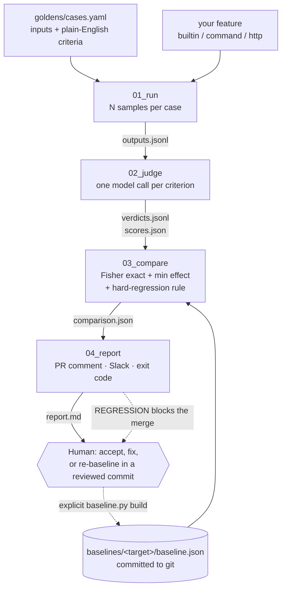

<div align="center">

# 🔬 regress

### Your prompt is the only file in the repo that ships with no test.

**This is that test — and it can tell a real regression from a bad roll of the dice.**

[](https://github.com/DreadpiratePickles/regress/actions/workflows/regression.yml)
[](tests/)
[](.python-version)
[](LICENSE)
[](docs/statistics.md)
[](src/regression_detect/judge/prompts/judge_v1.md)


</div>

---

It is a Tuesday. Someone opens the prompt file and adds one line — "be more helpful", or "mention the order id if
there is one". They paste two tickets into a playground, skim the two summaries, decide the new one reads nicer, and
merge. Three weeks later a support lead mentions in passing that the summaries have stopped saying how much money the
customer wants back. Nobody knows which change did it, and `git blame` will hand you six suspects, none of whom will
confess.

Normal tests do not catch this. A unit test asserts an exact value; the output here is a paragraph of English that
comes out different every single time, so there is no exact value to assert. And the obvious fix — run a suite of
cases, fail below some pass rate — does not work either, because the thing being measured is a biased coin rather
than a compiler. The same prompt on the same model scores 5/5 one afternoon and 4/5 the next. Threshold that and you
buy both failure modes at once: false alarms on runs where nothing changed, which teach the team to ignore the check
inside a month, and silence on real regressions that happen to land above the line.

So this tool refuses to call a lower score a regression. **A regression here means a drop large enough to matter that
is also too unlikely to be the dice** — both halves, or it is not a finding. It runs your golden cases through your
feature, has a model grade each output against plain-English criteria one criterion at a time, and compares the
resulting counts against a baseline committed in your repository using a one-sided Fisher exact test with a minimum
effect size. The verdict is decided by deterministic code that calls no model, so the same two inputs produce the
same p-value and the same sentence forever. It is the least exciting part of the system and the only part I would
defend in an argument.

If the p-value is wrong, I lose — every verdict this thing has ever printed sits on top of it. So it is checked
against a second implementation written independently in [`tests/test_compare.py`](tests/test_compare.py), which sums
the hypergeometric tail in exact rationals instead of floats, across ten different tables; plus one table small
enough to do by hand, where C(2,0)·C(2,2)/C(4,2) = 1/6. It isn't wrong.

**Prior art, credited properly.** [promptfoo](https://github.com/promptfoo/promptfoo),
[DeepEval](https://github.com/confident-ai/deepeval), [Braintrust](https://www.braintrust.dev/) and
[LangSmith](https://www.langchain.com/langsmith) are real tools built by people who have thought about this longer
than I have. They run evals well, they have UIs, integrations, dataset management and teams behind them, and if you
want a platform you should use one of them rather than this. What you get here that you do not get by default there
is narrower and specific: a verdict that is a **statistical comparison of two sets of counts** rather than a score
against a threshold you picked; a judge that is only ever asked **one bounded yes/no question per call**, with a
calibration harness pointed at it; and a **baseline that is a JSON file in your git history**, reviewed in a pull
request like any other file, with no account and no vendor holding your history.

The repository is `regress`; the Python package it installs is `regression_detect`.

## 🧩 Why a single run is not evidence

The argument above is the whole design, so it is worth being precise about it.

Run the same prompt through the same model twice and you get two different pass rates. That variation is not a bug in
the harness — it is the feature under test being non-deterministic, which is the entire reason you are here. A fixed
pass-rate threshold has no way to tell that variation from a change you caused. Set it high and it fires on quiet
weeks; set it low and it sleeps through the day the summaries stopped mentioning refunds. Moving it trades one
failure for the other and removes neither. You end up tuning a number until the check agrees with what you already
believed, which is a hobby rather than a test.

Comparing two sets of *counts* and asking how surprising the difference would be if nothing had changed fixes both
ends at once. That question has an exact answer for a 2×2 table — Fisher's exact test — and pairing it with a minimum
effect size stops a statistically significant half-point from blocking a build. The full derivation, including why
the test is one-sided, why Wilson intervals are reported but never decided on, and six limitations worth reading
before you trust a verdict, is in [`docs/statistics.md`](docs/statistics.md).

## 🔧 What it does

Five steps. Each one writes a file you can read and keep.

1. **Run** — every golden case goes through your feature `N` times, and each raw output is recorded with the
   provenance needed to reproduce it. → `outputs.jsonl`, `manifest.json`, `review.md`
2. **Judge** — a model grades each output against its criteria, **one criterion per call**, answering only yes/no
   plus a reason. → `verdicts.jsonl`, `scores.json`, `judged.md`
3. **Compare** — deterministic code (no model) matches this run's per-criterion counts against the committed baseline
   and applies the decision rule. → `comparison.json`
4. **Report** — the verdict becomes Markdown: the explanation, both pass rates with confidence intervals, every
   criterion that fell, and the judge's reason for each failure. → `report.md`
5. **Alert** — on a `REGRESSION` verdict only, and only if a webhook is configured, a Slack message goes out. → Block
   Kit payload

What you get out of it:

- **A pull-request comment with a verdict** — 🔴 `REGRESSION`, 🟢 `NO_REGRESSION` or 🟡 `INCONCLUSIVE` — and an exit
  code CI can act on.
- **A per-criterion diff**, so the finding is "`double_charge_refund` [2] stopped stating the refund request, 2/2 →
  0/1", not "the score went down".
- **The judge's reasoning** for every criterion that regressed, in a collapsible block, next to the candidate output
  that failed it.
- **An optional Slack alert**, gated three times over, so the first real send is one you chose rather than one you
  discovered at 2am.
- **Baselines in git.** The reference is a JSON file in your repository. No account, no dashboard, no vendor holding
  your history.

The judge is never asked to "score this summary 1 to 5". It is asked one bounded question per call — does this output
satisfy this one criterion, yes or no, and why — at temperature 0.0, and the reply must validate as exactly
`{reason, passed}` or it is recorded as unjudged rather than as a failure. That is partly rigour and partly the fact
that nobody, human or model, has ever known what a 3.5 out of 5 means.

## 🚨 See it catch a regression

Three rules were deleted from the summarizer's system prompt — the three-sentence limit, "this is a summary, not a
reply", and "only use information that is in the ticket" — and one bad instruction was added: *be helpful, suggest
next steps, and reassure the customer*. That is the whole change. The broken prompt is
[`docs/examples/regressed_prompt.md`](docs/examples/regressed_prompt.md).

**Nothing was tuned:** no threshold moved, no criterion rewritten, and the baseline was recorded before the broken
prompt existed. Here is the pull-request comment it produced, verbatim from
[`docs/examples/regressed_report.md`](docs/examples/regressed_report.md):

> ## Regression check — `2026-09-02T10-17-35Z`
>
> **🔴 REGRESSION**
>
> Pass rate fell from 93.3% (125/134) to 71.6% (48/67), a drop of 21.6 points;
> one-sided Fisher exact p = 0.0001 < 0.05 and the drop exceeds the 5-point
> minimum effect → REGRESSION.
>
> ### Overall
>
> | Measure | Baseline | Candidate |
> |---|---:|---:|
> | Passes / n | 125 / 134 | 48 / 67 |
> | Pass rate | 93.3% | 71.6% |
> | 95% Wilson CI | 87.7%–96.4% | 59.9%–81.0% |
>
> | p-value (one-sided Fisher exact) | Minimum effect | Alpha |
> |---:|---:|---:|
> | 0.0001 | 5 points | 0.05 |
>
> ### Criteria that got worse (17)
>
> | Case | # | Criterion | Baseline | Candidate | Drop |
> |---|---:|---|---:|---:|---:|
> | `ambiguous_no_request` | 4 | Is at most 3 sentences. | 2/2 (100.0%) | 0/1 (0.0%) | 100.0 points |
> | `broken_item_no_details` | 4 | Does not state that the customer wants a refund or a replacement (the ticket says neither). | 2/2 (100.0%) | 0/1 (0.0%) | 100.0 points |
> | `csv_export_how_to` | 4 | Is at most 3 sentences. | 2/2 (100.0%) | 0/1 (0.0%) | 100.0 points |
> | `double_charge_refund` | 2 | States that the customer wants a refund of the duplicate charge. | 2/2 (100.0%) | 0/1 (0.0%) | 100.0 points |
> | `double_charge_refund` | 4 | Is at most 3 sentences. | 2/2 (100.0%) | 0/1 (0.0%) | 100.0 points |
> | `forwarded_thread_import_failure` | 6 | Is at most 3 sentences. | 2/2 (100.0%) | 0/1 (0.0%) | 100.0 points |

The full report carries the remaining eleven worsened criteria, the three that improved, and a `<details>` block per
regressed criterion holding the candidate output and the judge's reason for failing it.

**The control run matters as much as the demo.** The *unmodified* prompt, same model, same baseline, produced 62/67 —
a 0.7-point drop, one-sided Fisher exact p = 0.53 — and the verdict was `NO_REGRESSION`. A single-run threshold
anywhere above 92.5% would have failed that build, on a change that did not exist. That is the false alarm this tool
is built to not raise, because a check people have learned to ignore is just a slower way of having no check.

## 🧭 How it works



| Stage | Command | Reads | Writes | Logic lives in |
|---|---|---|---|---|
| `01_run` | `scripts/run_goldens.py` | `goldens/cases.yaml`, the `[target]` config | `outputs.jsonl`, `manifest.json`, `review.md` | `src/regression_detect/runner.py` |
| `02_judge` | `scripts/judge_run.py` | a stage-01 run dir, `goldens/cases.yaml` | `verdicts.jsonl`, `judge_manifest.json`, `scores.json`, `judged.md` | `src/regression_detect/judge_runner.py` |
| `03_compare` | `scripts/compare.py` | `verdicts.jsonl`, `baselines/<target>/baseline.json`, `regression.toml` | `comparison.json` | **`src/regression_detect/compare.py`** |
| `04_report` | `scripts/report.py` | `comparison.json` | `report.md` | `src/regression_detect/report.py` |
| `04_report` (alert) | `scripts/alert.py` | `comparison.json`, `SLACK_WEBHOOK_URL` | Slack Block Kit payload | `src/regression_detect/alert_run.py` |
| all four | `scripts/detect.py` | everything above | the whole run directory | `src/regression_detect/pipeline.py` |

Two supporting commands sit outside the pipeline and never run in CI: `scripts/baseline.py` pools judged runs into a
baseline, `scripts/calibrate.py` grades the judge against human labels. The verdict itself is decided in exactly one
place — `compare.py` — and that module calls no model. It reads the verdict rows rather than `scores.json`, because a
ratio cannot be tested; matches criteria against the baseline on `(case_id, criterion_index, criterion_text)`; pools
them into a 2×2 table; and exits `0` NO_REGRESSION, `1` REGRESSION, `2` INCONCLUSIVE, `3` bad input. Stage 04
formats; it does no arithmetic whatsoever, which is the only reason you can trust the two to agree.

The decision rule, with the defaults from [`regression.toml`](regression.toml):

```
REGRESSION      if any criterion the baseline always passed (n ≥ 2) the
                candidate now always fails (n ≥ 2)          ← hard-regression rule
                or (pass-rate drop ≥ 5 points  AND  one-sided Fisher exact p < 0.05)

INCONCLUSIVE    else if nothing matched
                or fewer than 30 judged criteria
                or more than 20% of candidate judge calls failed

NO_REGRESSION   otherwise
```

Each stage also has a formal contract declaring what it is allowed to know: [01_run](stages/01_run/CONTEXT.md),
[02_judge](stages/02_judge/CONTEXT.md), [03_compare](stages/03_compare/CONTEXT.md),
[04_report](stages/04_report/CONTEXT.md).

## 📦 Install

### What you need

- **[uv](https://docs.astral.sh/uv/)** — the only thing to install by hand, with
  `curl -LsSf https://astral.sh/uv/install.sh | sh` on macOS or Linux.
- **Python 3.12** — pinned in [`.python-version`](.python-version); you do not install it, uv will.
- **A Gemini API key** — the free tier is enough. Get one at
  [aistudio.google.com/apikey](https://aistudio.google.com/apikey). Needed only for live runs; the verification step
  below works without one.

### 1. Clone and install

```bash
git clone https://github.com/DreadpiratePickles/regress
cd regress
uv sync
```

`uv sync` creates a `.venv/`, installs Python 3.12 if missing, and resolves the locked dependency set from `uv.lock`.
Success looks like a summary of installed packages and no error.

### 2. Add your key

The credential goes in `.env` at the repository root — one line, and the file is gitignored:

```bash
echo 'GEMINI_API_KEY=your-key-here' > .env
```

Nothing else needs configuring: model ids, thresholds and target choice all have working defaults.

### 3. Verify offline — no network, no spend

```bash
uv run pytest -q
uv run ruff check .
uv run python scripts/detect.py --dry-run --baseline baselines/summarizer/baseline.json
```

None of the 584 tests touches the network. The dry run substitutes canned in-memory providers for both target and
judge, so it needs no API key, makes no request and starts no subprocess — it exists to prove the four stages wire
together. Real output:

```
Run directory: runs/2026-09-02T11-47-54Z
  Stage 01: 15 call(s) — 15 ok, 0 failed
  Stage 02: 67 verdict(s) ok, 0 judge error(s), 0 output(s) skipped
  Stage 03: runs/2026-09-02T11-47-54Z/comparison.json
  Stage 04: runs/2026-09-02T11-47-54Z/report.md

Verdict: NO_REGRESSION

Pass rate rose from 93.3% (125/134) to 100.0% (67/67), a rise of 6.7 points; the pass rate did not fall → NO_REGRESSION.
  Baseline   93.3% (125/134)  95% CI 87.7%–96.4%
  Candidate  100.0% (67/67)  95% CI 94.6%–100.0%
  p-value    1.0000  (one-sided Fisher exact, alpha 0.05)
```

That verdict is meaningless — canned outputs pass canned criteria — and that is fine. The only thing it asserts is
that the tool ran; if you see it, you are installed, and this is exactly what CI's `unit` job checks. Artifacts land
in `runs/<UTC timestamp>/`, which is gitignored.

### Troubleshooting install

| Symptom | Cause and fix |
|---|---|
| `uv: command not found` | uv is not on your `PATH`. Re-open the shell, or see the [uv install docs](https://docs.astral.sh/uv/getting-started/installation/). |
| `uv sync` fails resolving Python | uv could not download 3.12. Run `uv python install 3.12` first. |
| Dry run exits `3` | The tool could not run at all — usually a missing or malformed `--baseline` path. Check the path is `baselines/summarizer/baseline.json`. |
| A live run raises a config error about the API key | `.env` is missing, in the wrong directory, or the line is quoted. It must be at the repository root and read exactly `GEMINI_API_KEY=...`. |
| A live run is mostly `judge error` rows | You are being rate-limited. Add `--min-interval-ms 6500`; see [Quota and pacing](#quota-and-pacing). |
| `ruff check .` reports findings on a clean clone | You are not on `main` at the published commit, or a local edit crept in. `git status` will say. |

## 🚀 Use it

This walkthrough uses the packaged ticket summarizer, so you can follow it end to end before pointing anything at
your own code. Commands that call a model are marked.

### (a) Run the goldens and read `review.md`

```bash
# calls the model: 15 target calls
uv run python scripts/run_goldens.py --samples 1 --min-interval-ms 6500
```

Stage 01 writes `runs/<ts>/review.md`: a checkbox document for a human, and the only artifact no code ever grades. It
exists so *you* can form an opinion before a model hands you one. Below is one case, generated with `--dry-run` — so
the output shown is the canned placeholder, not a real summary:

````markdown
## double_charge_refund

Tags: happy_path, billing
Why this case exists: Baseline billing case. Catches hallucinated identifiers.

### Input

```text
Hi, I ordered the blue running shoes last Tuesday and I see two charges of $89.99 ...
```

### Output

```text
The customer reports a problem with their order and is asking for help. This is a placeholder summary
produced by a dry run; no model was called.
```

### Criteria

- [ ] States that the customer was charged twice for one order.
- [ ] States that the customer wants a refund of the duplicate charge.
- [ ] Does not invent an order number (the ticket contains none).
- [ ] Is at most 3 sentences.
````

**What to look for.** Tick a criterion only if the output satisfies it *as written*; an unticked box is a fail, not a
maybe. You are hunting two things: an output that is obviously good but fails a criterion (the criterion is wrong —
fix it, because false alarms train people to ignore the tool), and an output that is subtly bad but passes everything
(a criterion is missing). The header records run id, model, prompt hash and goldens hash, so you always know what you
are grading.

### (b) Build a baseline

A baseline is per-criterion counts — for every `(case_id, criterion_index, criterion)`, how many times it was judged
and how many it passed — pooled across runs and committed to git:

```bash
# calls the model. Run twice, to get two run directories.
uv run python scripts/run_goldens.py --samples 1 --min-interval-ms 6500

# calls the model: once per run directory, 67 judge calls each
uv run python scripts/judge_run.py --run runs/<ts> --min-interval-ms 6500

# no model call
uv run python scripts/baseline.py build \
  --runs runs/<ts-a> runs/<ts-b> \
  --out baselines/<your-target>/baseline.json
```

`baseline.py show --baseline <path>` prints it back as a table. **Pool at least two runs:** one run leaves every
criterion at `n = 1`, which cannot tell a flaky criterion from a stable one and makes the hard-regression rule —
which needs `n ≥ 2` on both sides — permanently inert. `baseline.py build` refuses to pool runs that disagree on the
goldens hash, target prompt hash, target model id, judge prompt hash or judge model id: a different question, rubric
or model is a different measurement, and pooling them would launder the difference into the reference. Full rules:
[`baselines/README.md`](baselines/README.md).

### (c) Change the prompt and detect

`detect.py` runs all four stages in one process; `--prompt` points the target at a different system prompt without
editing anything:

```bash
# calls the model: 15 target calls + 67 judge calls
uv run python scripts/detect.py \
  --baseline baselines/summarizer/baseline.json \
  --prompt docs/examples/regressed_prompt.md \
  --min-interval-ms 6500
```

That is how the worked example in `docs/examples/` was produced. In real use you edit
`src/regression_detect/target/prompts/summarize_v1.md` (or your own feature) and drop the flag.

### (d) Read `report.md`

`runs/<ts>/report.md` is the exact Markdown CI posts on the pull request:

| Section | What it tells you |
|---|---|
| Verdict badge | 🔴 / 🟢 / 🟡 — the single-word answer. |
| Explanation | One sentence from stage 03: both rates, the drop, the p-value, and which rule fired. |
| Overall table | Passes/n, pass rate and 95% Wilson interval per side, then the p-value against `min_effect` and `alpha`. |
| Criteria worse / improved | The per-criterion diff — case, criterion index, criterion text. This is the part you act on. |
| What the judge saw | A `<details>` block per regressed criterion: the candidate output, and the judge's reason for failing it. |
| Provenance footer | Run id, samples, both model ids, and four hashes, so any number can be traced back. |

**The three verdicts, in plain words:**

- 🔴 **`REGRESSION`** (exit 1) — the drop is both big enough to matter and too unlikely to be noise, or a criterion
  went from always-passing to always-failing. **Do:** read the worsened table and the judge's reasons, then fix the
  change or accept it deliberately. Do *not* rebuild the baseline to clear it — that erases the finding instead of
  answering it.
- 🟢 **`NO_REGRESSION`** (exit 0) — no drop survived the test. **Do:** merge. This is not proof the change is an
  improvement, only the absence of evidence that it is a regression.
- 🟡 **`INCONCLUSIVE`** (exit 2) — too few judged criteria, nothing matched the baseline, or too many judge calls
  failed. **Do:** treat it as a tooling problem, usually rate limits — raise `--min-interval-ms` and re-run; if it
  persists, check that baseline and candidate share the same goldens and criterion text. CI passes with a warning,
  because "we could not tell" is not "it got worse".

Exit `3` is separate on purpose — the detector could not run at all (bad baseline, run directory or config) — and CI
treats it as a configuration fault.

### (e) Grade `review.md`, then calibrate the judge

Every count in every report is the judge's opinion, not the truth. A systematically lenient judge will report a
healthy pass rate over a broken feature, and nothing else in the pipeline would notice. Tick the criteria in
`review.md` by hand **first**, before opening `judged.md`, so your labels stay independent of the judge's. Then:

```bash
# no model call
uv run python scripts/calibrate.py --run runs/<ts> \
  --graded-cases double_charge_refund,sarcastic_slow_response
```

Only the cases you name are compared; the rest are ungraded, not failed. It writes `calibration.json` and prints the
agreement rate, every mismatch, and the two counts that matter: **`false_pass`** (the judge passed what you failed —
every one of those is a regression this tool would miss) and **`false_fail`** (noise; annoying, but it hides
nothing).

**No calibration numbers are published here.** The mechanism is implemented and unit-tested; the human labels have
not been collected, so there is no agreement rate to quote and I am not going to quote one. Treat the judge as
uncalibrated until you have run this against your own labels.

### (f) Re-baseline only when you *meant* to change something

A new baseline claims that the current quality is the quality worth defending, so it is a human decision. From
[`baselines/README.md`](baselines/README.md): read the candidate run's `judged.md` and satisfy yourself the change is
an intended improvement rather than a judge artefact or a loosened criterion; run `baseline.py build` explicitly
against the runs you want to pool; commit the file on its own, with a message saying what changed and why.

**Never regenerate a baseline to make a failing check pass.** A red verdict erased by a new baseline in the same pull
request has measured precisely nothing. It has, however, produced a green tick, which is what somebody wanted.

### Quota and pacing

`--min-interval-ms` paces both the target and the judge calls. Set it to `60000 / RPM` for a per-minute quota —
**6500** on the Gemini free tier. Without it a full detect run fires 82 calls as fast as the process can make them,
most judge calls come back as 429s, and those rows are recorded honestly as *unjudged* — not the same as scored, and
usually enough to push the verdict to `INCONCLUSIVE`.

**Match the model ids to the baseline you compare against.** The shipped `baselines/summarizer/baseline.json` was
recorded on `gemini-3.5-flash-lite` for both target and judge, while the package default is `gemini-3.6-flash`.
**Stage 03 refuses mismatched identities**: before it computes a single statistic it checks the candidate against the
baseline on `goldens_sha256`, `target_model_id`, `judge_model_id` and `judge_prompt_sha256`, and a mismatch is a
`ComparabilityError` naming the field and both values — exit 3, never a verdict, because running a different model is
a mistake in the setup rather than a regression in the diff. So pin them:

```bash
TARGET_MODEL_ID=gemini-3.5-flash-lite JUDGE_MODEL_ID=gemini-3.5-flash-lite \
uv run python scripts/detect.py \
  --baseline baselines/summarizer/baseline.json \
  --min-interval-ms 6500
```

The target prompt is the deliberate exception: its `prompt_sha256` is *expected* to differ, because changing it is
the usual reason to run the detector at all. Both sides' value is recorded in `comparison.json` under `identity`, and
the report's footer carries a one-line `Comparability:` summary of everything that was checked. For your own feature,
build a baseline on whatever model you actually run and leave the defaults alone.

## ⚙️ Put it in CI

[`.github/workflows/regression.yml`](.github/workflows/regression.yml) runs three deliberately separate jobs. Nothing
in the workflow file names a model, a threshold or a key.

| Job | Runs on | What it does |
|---|---|---|
| `unit` | every push to `main`, every pull request | `ruff check`, the full test suite, and one offline dry run through all four stages. Needs no secret and spends nothing. |
| `scope` | pull requests only | Reads the diff and decides whether this PR touches the surface the goldens measure. |
| `regression` | pull requests that touch that surface | Runs the real detector, uploads the run directory as an artifact, comments the report, and applies the verdict. |

The measured surface is `src/regression_detect/target/`, `src/regression_detect/judge/prompts/`, `baselines/`,
`goldens/`, or `regression.toml`; the filter is computed from the diff because GitHub's own `paths:` key is
workflow-wide and `unit` must run on every pull request. The verdict decides the check — `REGRESSION` fails it,
`INCONCLUSIVE` passes with a warning, exit 3 fails as a configuration fault. The workflow grants
`pull-requests: write` and nothing more: no auto-merge, no label change, no branch write, no status override. An eval
harness that can rewrite its own verdict is a press release, not a check.

### Secrets

```bash
gh secret set GEMINI_API_KEY      # required for the live check
gh secret set SLACK_WEBHOOK_URL   # optional: Slack alerts on REGRESSION
```

Both prompt for the value (or read stdin), so the secret never lands in your shell history.

| Secret | Required | What happens without it |
|---|---|---|
| `GEMINI_API_KEY` | for live runs | The job posts a short "skipped" comment and exits 0 — **not** a red check. |
| `SLACK_WEBHOOK_URL` | no | No alert is sent. With it, `alert.py` still posts only on a `REGRESSION` verdict; the gate is in the tool, not in the workflow. |

The live job also reads two **repository variables**, `TARGET_MODEL_ID` and `JUDGE_MODEL_ID` (`gh variable set`). Set
them to the model ids your committed baseline was recorded on — for the shipped one, `gemini-3.5-flash-lite` for
both. The workflow passes them through and still names no model itself. Leave them unset and the run does not
silently measure the wrong thing: stage 03's comparability check exits 3 with a message naming both values.

### The PR comment, and fork behaviour

The comment body is exactly the `report.md` shown in
[`docs/examples/regressed_report.md`](docs/examples/regressed_report.md); re-runs edit the previous comment
(`gh pr comment --edit-last`) rather than stacking a new one. Forks never receive repository secrets, and a fork's
`GITHUB_TOKEN` is read-only, so `gh pr comment` 403s there. Both are handled the same way: a missing key produces a
"skipped" comment and a green check, and every comment step carries `continue-on-error: true`. Only the verdict can
fail this workflow, because a check that goes red for reasons the author cannot fix gets ignored within a month.

## 🔌 Test your own feature

The summarizer is what this repo dogfoods, not what the tool is for. Pick a kind in the `[target]` section of a
config file; everything downstream is unchanged. Stage 01 talks to a `Target` — text in, text out, plus enough
identity to say what produced a run — and everything after it never knew what a summarizer was.

**The three blocks below are fragments, not whole config files** — a loadable config also needs `[compare]`, `[run]`
and `[models]`. Copy [`examples/external_target/regression.external.toml`](examples/external_target/regression.external.toml),
which is complete, and edit its `[target]` section.

```toml
# the packaged summarizer (the default; also what no [target] section means)
[target]
kind = "builtin"                    # optional: prompt_path, temperature
```

```toml
# any program: input on stdin, answer on stdout, non-zero exit on failure
[target]
kind = "command"
argv = ["uv", "run", "python", "examples/external_target/ticket_summarizer_app.py"]
timeout_s = 120.0
env_allowlist = ["GEMINI_API_KEY", "HOME"]      # optional: cwd
```

```toml
# a JSON endpoint, POSTed {input_field: text}
[target]
kind = "http"
url = "https://api.example.com/v1/summarize"
input_field = "ticket"
output_field = "summary"
auth_header_env = "MY_APP_TOKEN"    # the NAME of a variable, never a token; optional: timeout_s
```

Run the goldens through the worked external example — a standalone script
([`ticket_summarizer_app.py`](examples/external_target/ticket_summarizer_app.py)) with its own prompt, model id and
error handling, importing nothing from this package. That is the point: it stands in for your feature.

```bash
uv run python scripts/run_goldens.py \
  --config examples/external_target/regression.external.toml \
  --samples 1 --min-interval-ms 6500
```

### Security properties

- **`argv` is a list, never a shell string.** `subprocess.run` is always called with an argument list and
  `shell=False`, so a golden case's text can never become a command.
- **The child's environment is an allowlist.** A command target gets `PATH` plus the variables `env_allowlist` names,
  and nothing else — not every credential the parent happens to be holding.
- **Bearer tokens come from the environment by name.** `auth_header_env` names a variable, read at call time. A token
  never appears in a config file, in provenance, or in an error message.
- **Everything is bounded.** Every target has a timeout; HTTP responses are capped at 1 MiB before parsing and inputs
  at 20,000 characters before sending.
- **Diagnostics never carry the input.** A failing command's stderr is quoted back at most 500 characters,
  tail-first; the case input is not, because an error message travels further than a run directory.
- **`--dry-run` never starts your program.** For any non-builtin kind it substitutes a canned in-memory target
  recording `target_id = "fake:dry-run"`, so its numbers cannot be mistaken for a measurement of your feature.

### A new target needs its own baseline

A baseline is a statement about one feature under one prompt on one model; measured against a different feature the
same numbers answer a question nobody asked. Change the target, prompt, model or `argv` and the identity hash changes
— build a new baseline. The identity fields make this visible rather than silent: a run through the external example
records `model_id = "command:fdd00b9726fe751c"` where the summarizer baseline records `gemini-3.5-flash-lite`.
Details, including what provenance each adapter records: [`docs/external-targets.md`](docs/external-targets.md).

## 📋 Configuration reference

Everything that decides a verdict lives in [`regression.toml`](regression.toml), so changing it is a diff somebody
approves. **Model identifiers are deliberately absent** — they live in `src/regression_detect/target/config.py` and
`src/regression_detect/judge/config.py`, nowhere else.

| Key | Default | Meaning |
|---|---|---|
| `[compare] alpha` | `0.05` | Significance level for the one-sided Fisher exact test. A drop must be this unlikely under "nothing changed" before it counts. |
| `[compare] min_effect` | `0.05` | Smallest pass-rate drop worth failing a build over, as a fraction (0.05 = 5 percentage points). Significance alone is not enough. |
| `[compare] min_samples` | `30` | Fewest judged criteria the candidate needs before any verdict other than `INCONCLUSIVE`. Below this, absence of evidence is not evidence. |
| `[compare] max_judge_error_rate` | `0.2` | Largest share of candidate judge calls that may have failed before the run is treated as unreadable rather than as a result. |
| `[run] samples` | `1` | Samples per golden case for `detect.py` when `--samples` is not given. |
| `[models] target_model_id_env` | `"TARGET_MODEL_ID"` | *Name* of the environment variable that overrides the target model id. |
| `[models] judge_model_id_env` | `"JUDGE_MODEL_ID"` | *Name* of the environment variable that overrides the judge model id. |
| `[target] kind` | `"builtin"` | Which feature the goldens run through: `builtin`, `command` or `http`. An unknown key in this section is an error, not an ignored line. |
| `[target] prompt_path`, `temperature` | `summarize_v1.md`, `0.2` | `builtin` only: the system prompt file and sampling temperature. `--prompt` and `--temperature` win over both. |
| `[target] argv`, `timeout_s`, `cwd`, `env_allowlist` | — | `command` only. `argv` is **required** and is a list of strings, never `"prog arg"`; `timeout_s` seconds before the call is abandoned; `cwd` the subprocess working directory; `env_allowlist` the variable names it may inherit on top of `PATH`. |
| `[target] url`, `timeout_s`, `input_field`, `output_field`, `auth_header_env` | — | `http` only. `url` is **required**; `input_field` / `output_field` are the JSON keys the case input is sent under and the answer read back from; `auth_header_env` is the *name* of the variable holding a bearer token, never the token. |

Environment variables (names only; values belong in `.env` or a CI secret):

| Variable | Purpose |
|---|---|
| `GEMINI_API_KEY` | The provider credential. Required for any live run. |
| `TARGET_MODEL_ID` | Overrides the target model id. |
| `JUDGE_MODEL_ID` | Overrides the judge model id. Pin this to a different family than the target once you have a second key. |
| `SLACK_WEBHOOK_URL` | Where `alert.py --send` posts. Absent, nothing is sent. |

## ❓ Understanding the verdict (FAQ)

**Why not just a threshold?** A threshold cannot tell noise from signal. The same prompt on the same model scores
differently every run, so a fixed line fires on runs where nothing changed *and* stays quiet on real regressions that
land above it; moving it trades one for the other. Comparing two sets of counts and asking how surprising the
difference is fixes both at once.

**What's a hard regression?** A criterion the baseline passed **every** time (`n ≥ 2`) that the candidate now fails
**every** time (`n ≥ 2`). Across 67 criteria that is a 1.5-point drop — nowhere near `min_effect`, invisible in the
pooled p-value. But "the summary no longer ever states the refund amount" is exactly the regression this tool exists
to catch, so any hard regression is a `REGRESSION` on its own; the `n ≥ 2` on both sides keeps it from firing on a
single coin flip.

**Why did I get `INCONCLUSIVE`?** One of three things: no criterion matched the baseline (usually a criterion was
edited — criteria match on case id, position *and* text, because an edited criterion is a different question); fewer
than `min_samples` criteria were judged; or more than `max_judge_error_rate` of judge calls failed. It is a tooling
signal, not a quality one.

**Isn't Gemini judging Gemini biased?** Yes. A model grades text in its own house style more generously —
**self-preference bias** — and the bias moves when the target model moves, which is exactly the confound a regression
detector must not have. The judge shares the target's family here for the least principled reason available: one
provider key exists in this workspace. Two mitigations: pin `JUDGE_MODEL_ID` to another family once you have a second
key, and run `calibrate.py` against human labels watching `false_pass`. Full reasoning in the docstring of
`src/regression_detect/judge/config.py`.

**How many samples should I use?** At least two per side, pooled. One sample leaves every criterion at `n = 1`, which
cannot distinguish a flaky criterion from a stable one and makes the hard-regression rule inert; more samples buy
sharper counts at linear cost.

**Can I use another provider?** For the **target**, yes, today: use the `command` or `http` kind and your feature can
call whatever it likes. For the **judge**, the seam exists but only a Gemini adapter is written —
`src/regression_detect/providers/` defines a `Provider` protocol (`complete(system, user, temperature) -> str` plus
four typed errors) and nothing outside that package names a vendor, so adding one is confined to it.

**Does it send my data anywhere?** Only to the model provider you configure. No telemetry, no account, no backend;
run artifacts stay in `runs/` (gitignored) and baselines in your repository. The one thing that leaves the machine on
its own is the Slack alert, gated three times over: dry run by default, `SLACK_WEBHOOK_URL` must be present, and only
a `REGRESSION` verdict posts unless `--always` says otherwise.

**How much does a run cost?** In calls, for this repo's 15 cases and 67 criteria, one `detect.py` run makes **15 ×
samples target calls + 67 × samples judge calls** — 82 at the default `samples = 1`. Multiply by whatever your
provider charges for the models you pinned; on a free tier the binding constraint is requests per minute, not money,
which is what `--min-interval-ms` is for. `--dry-run`, `compare.py`, `report.py`, `baseline.py` and `calibrate.py`
make zero calls.

## 📚 The golden dataset

15 cases, 67 criteria, human-authored and independently reviewed, in [`goldens/cases.yaml`](goldens/cases.yaml). One
case, verbatim:

```yaml
- id: double_charge_refund
  tags: [happy_path, billing]
  input: |
    Hi, I ordered the blue running shoes last Tuesday and I see two charges of
    $89.99 on my card statement. I only placed one order. Please refund the
    duplicate charge. Thanks, Maria
  criteria:
    - States that the customer was charged twice for one order.
    - States that the customer wants a refund of the duplicate charge.
    - Does not invent an order number (the ticket contains none).
    - Is at most 3 sentences.
  notes: Baseline billing case. Catches hallucinated identifiers.
```

**Criteria, not answers.** Never write the expected output — write what any acceptable output must, or must not,
contain. That is the only form that survives a non-deterministic feature: the summary changes every run, "does not
invent an order number" does not. Negative criteria are the strongest regression detectors, because hallucination is
the most common way a prompt change silently breaks something.

One check per criterion ("states A and mentions B" cannot be answered yes/no when only A is true), and a criterion
must never fail a *correct* output. Case ids are stable forever, because baselines key on them. Adversarial cases
earn their keep: the set includes an empty-ish ticket, a non-English ticket, a forwarded thread, and a ticket that
tries to give the model new instructions, because sooner or later somebody will. Full rules:
[`goldens/README.md`](goldens/README.md).

## 🩹 Honest caveats

Below are the things I would want to know before trusting a verdict from someone else's tool. None of them is fixed
by reading further down.

**The judge is uncalibrated.** `calibrate.py` is implemented and unit-tested, but no human labels have been
collected, so there is no agreement rate to publish and none is published. Until you run it against your own ticks,
every pass rate in every report is an unaudited model opinion wearing a percentage sign.

**The judge and the target are the same model family.** Both default to Gemini, because exactly one provider key
exists in this workspace. That is self-preference bias sitting directly inside the measurement, and it is the
confound a regression detector least wants. The mitigation is written and waiting on a second key: pin
`JUDGE_MODEL_ID` to another family.

**The live CI check has never executed.** The `unit` job ran green on the first push to `main` — lint, the full test
suite and the offline dry run, 18 seconds:
[run 33625981057](https://github.com/DreadpiratePickles/regress/actions/runs/33625981057). The `scope` and
`regression` jobs were skipped there, because they only run on pull requests, and no pull request touching the
measured surface exists yet. Read that half of the workflow as reviewed design, not verified behaviour. **And no
Slack message has ever been sent** — the payload is built and unit-tested, and that is the whole claim.

**Fisher's test assumes the criteria are independent, and they are not.** The criteria of one case grade the *same*
output, so they fail together. The effective sample size is therefore smaller than `n` suggests and the p-value is
somewhat **anti-conservative** — a little quicker to call a regression than the number implies. Two things blunt it:
`min_effect`, which correlation does not touch, and the per-case table, which makes it visible when the entire drop
came from one case. A clustered test or a case-level bootstrap is the real fix, and it is a known gap rather than an
oversight. It is written down in [`docs/statistics.md`](docs/statistics.md) alongside five more, which is where
limitations belong.

## 📊 Status

Verified locally, on this commit: **584 tests passing, 97% statement coverage, `ruff` clean**, and the four stages run
end to end both offline (canned providers) and against a live model. The worked example in `docs/examples/` is real
output from a real run.

| | State |
|---|---|
| Stages 01–04, three target adapters, baseline tooling, calibration tooling | Implemented and unit-tested |
| End-to-end detection against a live model | Verified: a real regression caught, and a control run correctly cleared |
| CI `unit` job (lint, tests, offline dry run) | Verified on GitHub: green on the first push to `main`, [run 33625981057](https://github.com/DreadpiratePickles/regress/actions/runs/33625981057) |
| CI `scope` + `regression` jobs (the live check) | Written and reviewed; **not yet exercised** — needs a pull request touching the measured surface and a `GEMINI_API_KEY` secret |
| Slack alert | Payload built and tested; **no real webhook send has been performed** |
| Judge calibration | Tooling implemented; **no human labels collected, so no agreement rate is published** |

Roadmap, roughly in order of how much it would improve the verdict:

- [ ] **Cross-provider judge.** A second provider key means pinning `JUDGE_MODEL_ID` to a different family across
      baseline and candidate, removing the self-preference confound described above.
- [ ] **Judge self-consistency.** Grade the same criterion `k` times and report the disagreement rate, so judge noise
      becomes a number rather than a caveat.
- [ ] **Clustered statistics.** A case-level bootstrap or clustered test, fixing the independence assumption above.
- [ ] **More target adapters**, and per-case history across a branch rather than one replaced PR comment.

## 🗂 The floor plan

```
CONTEXT.md                          router: which stage owns which job
regression.toml                     the thresholds a verdict rests on — no model ids
stages/*/CONTEXT.md                 01_run · 02_judge · 03_compare · 04_report contracts
.github/workflows/regression.yml    how the stages run in CI, and what fails a PR
docs/statistics.md                  why stage 03 uses these tests, and their limits
docs/external-targets.md            pointing the detector at your own feature
docs/examples/                      broken prompt → report, comparison.json, Slack payload
goldens/                            cases.yaml + the rules a case must satisfy
baselines/summarizer/baseline.json  committed reference scores
examples/external_target/           a standalone app + config, target-agnostic proof
scripts/                            run_goldens · judge_run · compare · report · alert ·
                                    baseline · detect · calibrate
src/regression_detect/
  goldens.py                        dataset loader + validation
  runner.py  review.py  pacing.py   stage 01: run, render review.md, space calls
  judge_runner.py  judge_inputs.py  stage 02: judge each criterion, read runs back
  scoring.py                        verdict records, pass-rate arithmetic, judged.md
  baseline.py  baseline_inputs.py   stage 03: pool judged runs into a baseline
  compare.py                        stage 03: Fisher exact, Wilson, the decision rule
  comparison.py  compare_run.py     the comparison record, its JSON, the CLI
  report.py  report_inputs.py       stage 04: render report.md — pure, no decisions
  alert_run.py  alerts/slack.py     stage 04: the three gates, Block Kit payload
  pipeline.py  config_file.py       stages 01 → 02 → 03 → 04; reads regression.toml
  calibration.py                    human ticks vs judge verdicts — no model call
  providers/ judge/ target/         provider seam · judge prompt+config · target + adapters
tests/                              584 tests; none touches the network
runs/                               per-run artifacts (gitignored)
```

## 🧱 Design principles

- **Deterministic code decides; the model only judges bounded questions.** Stage 03 calls no model — the same two
  inputs always produce the same verdict, p-value and sentence, which is what makes a verdict reviewable. The model
  is asked one kind of question: *does this output satisfy this criterion, yes or no, and why.*
- **Model output is untrusted input.** Every reply is validated at the boundary — type, shape, exact key set,
  non-empty — before anything downstream reads it. A judge reply that will not parse becomes `passed: null` and is
  excluded from `n`, never quietly turned into a failure. Ticket text goes into the user message inside `<ticket>`
  delimiters, never into a system prompt.
- **Prompts and model ids are configuration.** Model identifiers live in exactly two modules; thresholds live in
  `regression.toml`, so moving one is a diff somebody approves — tuning a threshold in response to a specific verdict
  is the same act as deleting the test, only harder to notice in review.
- **No creator grades its own work.** Stage 01 produces `review.md` for a human; stage 02 grades stage 01; stage 03
  grades neither and does arithmetic; calibration grades stage 02 against human labels. During development, review
  was done by independent verifier agents.
- **Partial failure is visible** — recorded per item, counted in the manifest, reflected in the exit code. A failed
  call never becomes an empty success.
- **Every stage has a contract**, and its inputs table is exhaustive on purpose: `scores.json` is explicitly *not* an
  input to stage 03, `review.md` is explicitly *not* an input to the judge.
- **Secrets never enter source, prompts, logs or artifacts** — and neither does an absolute path, because a report is
  a shared document and my home directory is not part of the evidence.

## 🎓 Learn from this repo

This was built as a teaching project — by Bobby Meher with Claude as pair programmer and teacher, as a way to learn
how evaluation, LLM-as-judge and the statistics of noisy measurement actually fit together, rather than as a product
with a launch date. It is laid out to be read.

- **[`CONTEXT.md`](CONTEXT.md)** is the router: a table mapping every job to the stage that owns it.
- **Every stage has a `CONTEXT.md`** — [01_run](stages/01_run/CONTEXT.md), [02_judge](stages/02_judge/CONTEXT.md),
  [03_compare](stages/03_compare/CONTEXT.md), [04_report](stages/04_report/CONTEXT.md) — declaring objective, inputs
  (each with a layer and an authority level), process, outputs, verification, approval and failure behaviour.
  Reading one tells you what a stage is allowed to know.
- **[`docs/statistics.md`](docs/statistics.md)** is the one to read if you read one: why a single run is not
  evidence, Fisher's exact test, `min_effect`, the Wilson interval, the hard-regression rule, six limitations.
- **[`goldens/README.md`](goldens/README.md)** is a short course in writing eval criteria that survive a
  non-deterministic feature, including two traps found the hard way; **[`baselines/README.md`](baselines/README.md)**
  explains why a baseline is counts rather than a rate.
- **The docstrings carry the reasoning**: `judge/config.py` on self-preference bias, `alert_run.py` on the three
  alert gates, `providers/base.py` on the vendor seam.

## 🤝 Contributing

Issues and pull requests are welcome, particularly on the statistics and on target adapters. If you disagree with the
decision rule, [`docs/statistics.md`](docs/statistics.md) is where that argument should be had, and I would rather
have it than not. Before opening one:

```bash
uv run ruff check . && uv run pytest -q
uv run python scripts/detect.py --dry-run --baseline baselines/summarizer/baseline.json
```

A pull request touching `src/regression_detect/target/`, `src/regression_detect/judge/prompts/`, `baselines/`,
`goldens/` or `regression.toml` also runs the live regression check, when the maintainer's key is available.

## 📄 Licence

[MIT](LICENSE).

---

<div align="center">

*Deterministic code decides; the model only ever answers yes or no.*
*The baseline lives in your git history, where you can argue with it.*

</div>
